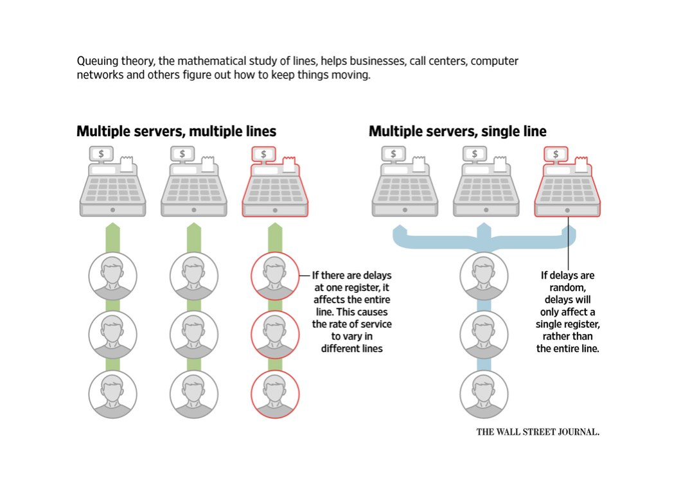

# Bank Queue Simulation

### Background
Queueing Theory refers to the mathematical study of waiting lines and queues. This topic, along with the Queue data structure, is one of the core concepts taught in almost all Data Structures and Algorithms courses. This project seeks to touch upon Queuing Theory, particularly the comparison between single and multi-line queues, to see which would perform better in serving a varying number of customers within a controlled simulation.

Figure: The Line Dance - Queueing Theory[1]

### About the Bank Queue Simulation
The task of creating this simulator involved three (3) requirements:

- Design and implement a circular array-based queue data structure. Implement the following operations: enqueue, dequeue, front, size, isEmpty, and isFull.
- Use your queue implementation to simulate a bank with 3 tellers and one line. The time between arrival of customers is a random integer between 1 and 5. When a customer arrives, the customer gets in line. When any of the three tellers is available, the first customer in line goes to that teller. The time to process that customer’s transaction is another random integer between 1 and 5. When the transaction is completed, the customer leaves. Run the simulation for 100 customers. Report the average time the customer waits in the queue.
- Modify your implementation so that each teller has a separate queue. When customers arrive, they enter the shortest queue (and stay in that one, never switching queues). Run both versions of the algorithm for an identical set of 100 customers with the same arrival and transaction times.

### Implementation Summary
The main program’s implementation is built using Java and the Java Threads library. Using an Object-oriented approach, I modeled a bank with these following classes (on top of a custom Queue data structure implementation)

- Customer - Models a customer that can track its own time in a queue (Regular class).</li>
- Receptionist - Handles customer flow and intake (Thread class).</li>
- Teller - Serves customers that are in queue (Thread class).</li>
- BankSimulation - A bank that can either have a single queue or a multi-queue line (Thread class).</li>

Using these classes (that are extended with the Java threads), the entire simulation is run in parallel, with a custom time acceleration factor and a synchronization mechanism to maximize accurate simulation results.

### References
[1] McGinty, Jo Craven. “The Science of Standing in Line.” The Wall Street Journal, Dow Jones &amp; Company, 7 Oct. 2016, www.wsj.com/articles/the-science-of-standing-in-line-1475850601.
